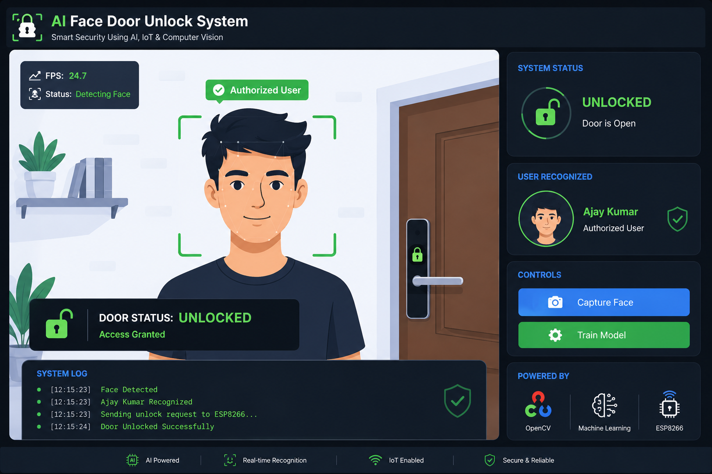
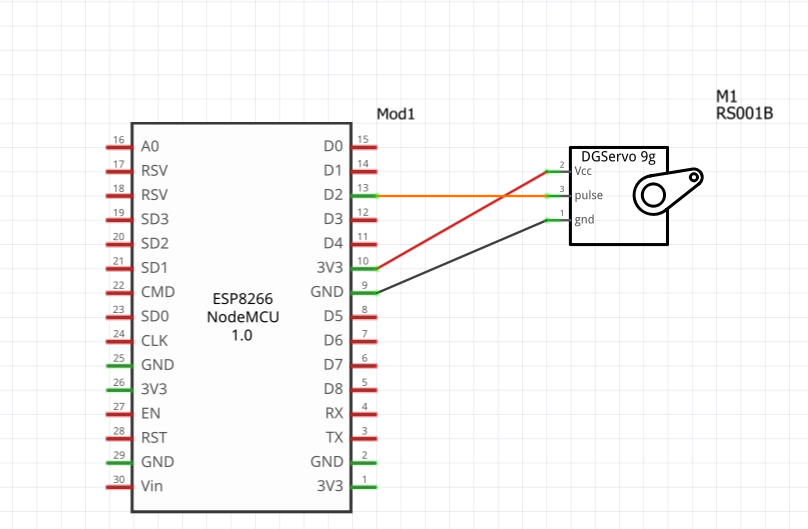
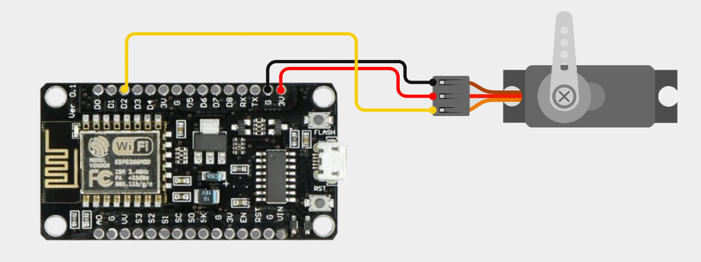

# 🔐 AI Face Door Unlock System  
### Smart IoT Security using OpenCV + ESP8266 + Machine Learning

<p align="center">
  
</p>

---

## 🚀 Project Overview

An AI-powered smart security system that detects and recognizes authorized faces using **Computer Vision** and automatically unlocks a door using an **ESP8266 NodeMCU** and **Servo Motor**.

This project combines:

- 🤖 Artificial Intelligence
- 👁️ Computer Vision
- 🌐 IoT Automation
- 🧠 Machine Learning
- 🔓 Smart Door Access Control

---

# ✨ Features

✅ Real-Time Face Detection  
✅ Face Recognition using KNN Algorithm  
✅ Automatic Door Unlocking  
✅ ESP8266 WiFi Communication  
✅ Servo-Based Smart Lock System  
✅ Lock/Unlock Status Display  
✅ Cooldown Protection System  
✅ Dataset Collection & Training  
✅ Lightweight and Fast Processing  

---

# 🧠 Technologies Used

| Technology | Purpose |
|---|---|
| Python | Main Programming |
| OpenCV | Face Detection |
| Scikit-Learn | Machine Learning |
| NumPy | Data Processing |
| ESP8266 NodeMCU | IoT Controller |
| Servo Motor | Door Lock Mechanism |
| HTTP Requests | Communication |

---

# 🏗️ System Architecture

```text
Webcam → OpenCV Face Detection → KNN Recognition
       → Authorized User Detected
       → HTTP Request Sent to ESP8266
       → Servo Motor Unlocks Door
```

---

# 📸 Project Preview

## 🖥️ Face Recognition System

<p align="center">
  
</p>

---

# 🔌 ESP8266 Servo Connection Diagram

## 📘 Circuit Diagram

<p align="center">
  
</p>

---

## 🔧 Real Wiring Connection

<p align="center">
  
</p>

---

# ⚙️ Hardware Components

| Component | Quantity |
|---|---|
| ESP8266 NodeMCU | 1 |
| Servo Motor SG90 | 1 |
| Webcam | 1 |
| Jumper Wires | Few |
| USB Cable | 1 |
| Door Lock Mechanism | Optional |

---

# 📂 Project Structure

```text
Face-Door-Unlock-System/
│
├── dataset/
├── images/
│   ├── demo.png
│   ├── circuit-diagram.png
│   └── wiring.png
│
├── esp8266/
│   └── esp8266_servo_unlock.ino
│
├── main.py
├── requirements.txt
├── README.md
├── .gitignore
└── LICENSE
```

---

# 🧪 Machine Learning Workflow

## 1️⃣ Face Collection
- Capture user face images
- Store inside dataset folder

## 2️⃣ Model Training
- KNN classifier trains using collected faces

## 3️⃣ Real-Time Recognition
- Detect face using OpenCV Haarcascade
- Predict authorized user

## 4️⃣ Door Unlocking
- Python sends unlock request to ESP8266
- Servo rotates and unlocks the door

---

# 🖥️ Python Installation

## Install Dependencies

```bash
pip install -r requirements.txt
```

---

# ▶️ Run the Project

```bash
python main.py
```

---

# 📡 ESP8266 Communication

The Python system sends an HTTP request:

```python
http://192.168.4.1/unlock
```

ESP8266 receives the request and rotates the servo motor to unlock the door.

---

# 📜 ESP8266 Code

Place your ESP8266 Arduino code inside:

```text
esp8266/esp8266_servo_unlock.ino
```

---

# 🛡️ Security Features

✅ Authorized Face Recognition  
✅ Cooldown Timer Protection  
✅ Auto Re-Lock System  
✅ Offline Local Processing  
✅ No Cloud Dependency  

---

# 📈 Future Improvements

- 🔥 Deep Learning Face Recognition
- 📱 Mobile App Control
- ☁️ Firebase Database Integration
- 📸 Visitor Image Logging
- 🔔 Telegram Notifications
- 🧠 YOLO Face Detection
- 🏠 Smart Home Integration
- 🌐 Remote Monitoring Dashboard

---

# 📚 Learning Concepts

This project demonstrates:

- Computer Vision
- Machine Learning
- IoT Communication
- Embedded Systems
- AI Automation
- HTTP Networking
- Smart Security Systems

---

# 👨‍💻 Author

## Ediga Ajay Kumar

🎓 AI & Robotics Developer  
🤖 IoT | Computer Vision | Machine Learning | Embedded Systems

---

# 🌟 GitHub Topics

```text
opencv
python
esp8266
iot
face-recognition
machine-learning
computer-vision
smart-door-lock
artificial-intelligence
automation
```

---

# 📄 License

This project is licensed under the MIT License.

---

# ⭐ Support

If you like this project:

⭐ Star the repository  
🍴 Fork the project  
📢 Share with others  

---
